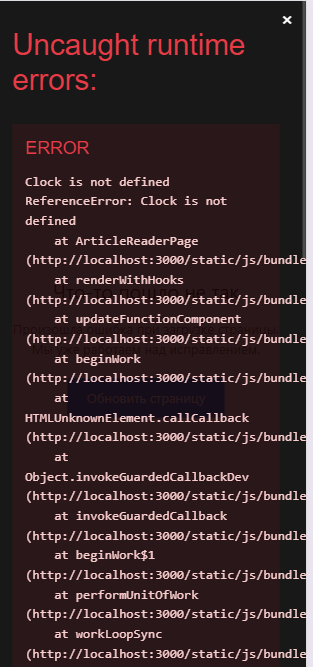

## 📋 Сеты для сигарной дегустации

<aside>
🐟

**Рыбный сет:**

1. Мини-круассаны с форелью и соусом песто.
2. Карпаччо из королевских креветок с апельсином.
3. Салат с морепродуктами и мятым авокадо.
4. Филе сибаса с томатно-цитрусовым соусом.
5. Шарик домашнего сорбета на выбор.

💰: **6360 вместе с сервисом.**

</aside>

<aside>
🌿

**Вегетарианский сет:**

1. Брускетта с ароматными лесными грибами (сливки можно убрать).
2. Тартар из узбекских томатов с баклажанами.
3. Итальянский овощной суп Менестроне.
4. Зеленое Ризотто.
5. Пудинг чиа-овес.

💰: **3730 вместе с сервисом.**

</aside>

<aside>
🐂

**Мясной сет:**

1. Тапас с хамоном и мягким сыром.
2. Тартар из премиальной говяжьей вырезки.
3. Салат с сочной телятиной и ароматными грибами.
4. Томленые говяжьи щечки с солодом.
5. Шарик домашнего сорбета на выбор.

💰: **6350 вместе с сервисом.**

</aside>

<aside>
🐓

**Птица:**

1. Брускетта с бурратой и сочными томатами.
2. Карпаччо из свёклы с мягким сыром.
3. Теплый салат с фуа-гра и перепелкой.
4. Утиная ножка под апельсиновым соусом.
5. Шарик домашнего сорбета на выбор.

💰: **6210 вместе с сервисом.**

</aside>

<aside>
💡

1. Соответствующие кнопки заведены в 1С (но это не точно).
</aside>

